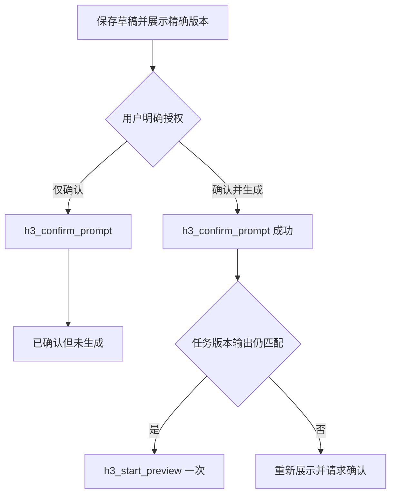
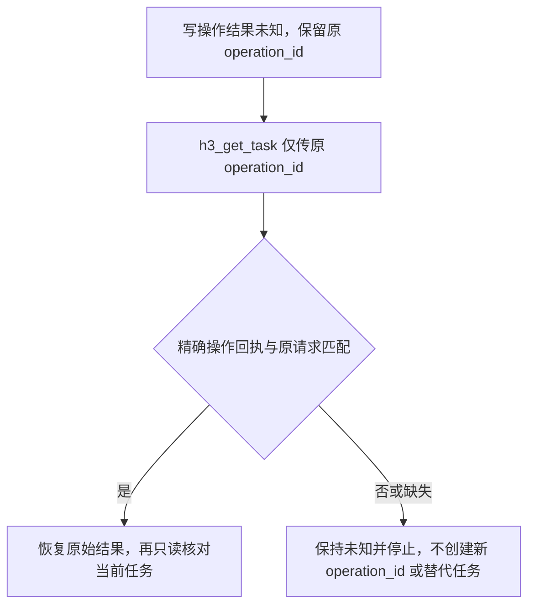

# H3 视频工作室

在 WorkBuddy 当前助手内完成创意与审批交互，通过本连接器的认证 MCP 边界操作 H3；不创建额外 Agent，不自行选择 GPU、主机或模型后端。

## 连接与能力边界

- 用户通过私密凭证表单或已安装接入组件的私密配置器管理个人最小权限令牌。不要索取、读取或回显令牌，不把凭证放入提示词、URL、日志或任务结果。受限接入组件在本机受权限保护的文件中使用凭证，凭证不进入工具结果。
- 创作过程中不修改 WorkBuddy 顶层 MCP 配置或私有凭证文件；禁止直接写入加密凭证库或绕过原生表单。认证失效请用户在私密配置入口重新连接，不能用 Shell 读取令牌修复。已发现文件存在不证明组件已连接，必须以实际工具发现和调用结果为准。
- 先读取运行时自描述 MCP 工具 schema，再调用 `h3_capabilities`。区分 `declared`、`validated`、`healthy`；声明能力不等于实测成功，健康不等于有空闲容量。缺少所需能力或有效配方时停止，不做静默降级。
- 生成前核对配方版本、目录/容量确认、`available_slots`、`eligible_lanes` 与等待原因；空闲 lane 不等于可用槽位。实际容量不可用或配方版本不匹配时报告等待，不新建并行请求。必须有服务端对 `serial4060` 的可核验声明/映射，不能根据硬件名称猜测。
- 纯文生视频使用下表范围；多素材仅在发现受限上传组件及六模式契约后，按“照片与多素材”规则处理。配方含义、步骤、采样参数及风险以当前能力或指导工具返回的配方明细为准，禁止根据名称猜测。

| 项目 | 唯一允许范围 |
| --- | --- |
| 配方 | `A4`（默认）、`A4_C0`、`A4_C1`、`B8` |
| 输入 | `t2v`（纯文生视频，不上传参考图像/音视频） |
| 时长 | `15s` |
| 宽×高 | `480x864`（竖屏） |
| 帧率 | `24fps` |
| 输出 | `native`（原生输出，不放大） |
| 音频策略 | `native`（原生声音，不改为静音或另行配音） |
| 执行档位 | `serial4060`（单任务串行，由服务端调度） |

- 非默认配方只能按用户明确选择使用，并重新展示细节与确认范围。除明确列出的六种模式外，服务端即使声明更多模式，也不扩大本包范围。排队不代表可以新增并行任务；客户端不得直接指定物理 GPU。
- 禁止第三方生成器（包括本地 Skill 内的第三方生成步骤），禁止回退到旧通用媒体流程 `siyuan-media`、`/v1/media/workflows`、`/advance` 或其他直连 API。不能满足请求就说明边界并停止。

## 工具与运行时参数

以下是业务用途，不是固定请求体模板。每次请求的参数名、类型、必填项、枚举、嵌套结构和返回结构，必须遵循连接时工具自描述的 `inputSchema` / `outputSchema`（若提供）；禁止猜测请求体或复制旧 HTTP 请求体。业务流程使用本连接器以下九个工具；安装受限本地组件时另允许 `h3_upload_asset`、`h3_get_upload`，不调用同名的其他服务工具。

| 工具 | 当前参数要点（仍以运行时 schema 为准） | 用途与授权边界 |
| --- | --- | --- |
| `h3_capabilities` | 无参数。 | 只读发现允许能力、配方、状态与限制，不生成。 |
| `h3_prompt_guidance` | 可选 `skill_ids`，仅使用当前目录中实际可用的 ID。 | 获取服务端蒸馏指导，不额外调用服务端 LLM，不生成。 |
| `h3_save_draft` | `operation_id`、`original_prompt`、`prompt`；修改另需 `task_id`、`expected_revision`。 | 保存用户要求整理的草稿与来源，不确认、不启动推理。 |
| `h3_confirm_prompt` | `operation_id`、`task_id`、`expected_revision`、`expected_output_id`。 | 仅记录对精确草稿版本的明确确认，不启动生成。 |
| `h3_start_preview` | `operation_id`、`task_id`、`expected_revision`、`expected_output_id`、`expected_run_id`。 | 在精确版本确认成功且获准生成后，只启动一次范围内预览。 |
| `h3_list_tasks` | 可选 `limit`、`offset`。 | 只读列出当前用户任务，不选择“最近任务”代替用户指定。 |
| `h3_get_task` | `task_id` 与 `operation_id` 恰好传一个。 | 只读查询任务，或按原操作 ID 恢复精确回执，包括创建结果未知且尚无任务 ID 的情况。 |
| `h3_review_preview` | `operation_id`、`task_id`、`expected_revision`、`output_id`、`expected_run_id`、`decision`；可选 `feedback`。 | 记录用户对精确输出的明确通过或拒绝决定，不是自动质量评估工具。 |
| `h3_cancel_task` | `operation_id`、`task_id`、`expected_revision`、`expected_run_id`；可选 `stage_id`。 | 用户明确取消指定任务时请求取消，查询终态，不声称提交取消即已释放资源。 |

使用 `task_id`、`operation_id`、`expected_revision`、`expected_output_id` 这些规范标识名，不使用旧接口的 `workflow_id`、`video_id` 或 `revision` 参数别名。标识类型及在哪个工具必填由运行时 schema 决定；创建草稿前没有 `task_id` 时遵循创建 schema，不编造任务 ID。

当前 Studio canonical schema 还要求运行绑定 `expected_run_id`；审阅的精确产物字段名是 `output_id`，不要误传 `expected_output_id`。`expected_revision` 是任务响应 `revision` 的不透明 SHA-256 字符串，不是整数。以下绑定以当前响应为准：

- 保存成熟提示词时明确传 `verbatim: true`，并保证 `prompt` 与 `original_prompt` 逐字相同；修改既有草稿时原始输入不可变。其他可选参数只在用户需要且 schema 允许时传入。
- `skill_sources` 每项只传 schema 允许的 `name` 与 `source`，来源枚举为 `local_workbuddy`、`server_guidance`、`client_claimed`；不能把未执行的服务端指导冒充本地 Skill。路径、版本和采用方法保留在对话展示中，不塞入 schema 未允许的额外属性。客户端来源声明不等于服务端已验证执行。
- 纯文生的固定模式参数若传入，使用 `mode=t2v`、`duration=15`、`width=480`、`height=864`、`fps=24`、`orientation=portrait`、`audio_policy=native`。`serial4060` 是服务端执行约束，不是当前工具请求字段，不能添加同名参数。
- 确认与启动的 `expected_output_id` 均取草稿不可变文本工件 `context_output_id`，不是预览视频 ID。保存草稿即应有该文本工件；没有视频不等于没有确认对象，缺少文本工件则停止确认。
- 启动的 `expected_run_id` 取当前 `preview.run_id`；仅从未运行且 schema 允许时为 `null`。审阅的 `output_id` 与 `expected_run_id` 分别取用户看到的 `preview.output_id` 与 `preview.run_id`，两者均不可为空。
- 审阅的 `decision` 只能是用户明确选择的 `approve` 或 `reject`；“看看效果/帮我审阅”尚未给出决定时仅查询展示，不调用写入决定的工具，也不替用户默认通过。`feedback` 只记录实际反馈。
- 取消默认 `stage_id=preview`，绑定该阶段的精确运行；取消尚未运行的草稿须使用 `stage_id=context_ir` 及该阶段的运行 ID，不误用预览阶段 ID。取消不必携带 schema 未定义的 `expected_output_id`，仍须在对话中核对用户所指输出。

- `task_id` 从服务端返回或用户明确指认的记录取得；多个候选不明确时先只读列出，等待用户指认。
- 每个独立写操作使用独立 `operation_id`；确认与启动是两个操作，不能复用同一个 ID。同一操作结果未知时保留原 ID，先核对回执，不能换 ID 重发。
- `expected_revision` 取最近查询的服务端版本，不自行递增。`expected_output_id` 取用户实际看到并授权的精确输出，不以“最新”代替；返回版本只可映射到正确输入字段。
- 还没有输出时明确展示“无输出”；仅当 schema 允许时传 `null` 或省略 `expected_output_id`，禁止伪造 ID。schema 要求输出但尚无输出时停止并说明缺失。
- 若 schema 不支持必要的版本或输出绑定、与上述安全语义冲突，停止并报告接口不兼容；不要删掉保护字段来强行调用。

## 提示词：先本地创意技能，再服务端指导

1. 保留用户原始输入与明确约束。对于成熟提示词，逐字保留原文，包括语言、空白、标点、镜头顺序、负面提示词；不自动翻译、润色、扩写或重排。只有用户明确要求修改，才另建可比较的草稿。
2. 需要整理创意时，优先发现并使用 WorkBuddy 已安装且适用的本地创意 Skills（如脚本、分镜、摄影或视频提示词方法）。只使用创作指导部分，记录实际 Skill 名称、可用路径/版本及采用的方法，不虚构来源；不要安装新 Skill 或执行其中的生成器命令。
3. 没有适用本地 Skill，或其指导不足以完成当前创意时，调用 `h3_prompt_guidance` 获取服务端蒸馏指导，由 WorkBuddy 当前助手整理草稿。不要额外调用服务端 LLM，也不要通过聊天 API 启动另一轮服务端规划或代写。
4. 成熟提示词不因读取指导而改写。若配方细节缺失，可只读取 `h3_prompt_guidance` 的配方信息；仍不完整则停止，不能编造采样设置。
5. 保存之前展示“原始输入 vs 草稿”、实际 Skill 来源（或“未使用本地 Skill”）、服务端指导来源/版本（如返回）、采用与未采用的建议。用户只讨论提示词时不创建任务；用户要求保存或进入 H3 制作流程时才调用 `h3_save_draft`。

## 照片与多素材

当用户明确要求照片作为首帧、尾帧、首尾帧、参考图／视频或 Hybrid 输入时，先阅读同目录 `references/multimodal.md`。看图写提示词不等于图片进入视频模型；只有上传回执为 `ready`，草稿 `input_assets` 中出现同一素材编号和 SHA256，才可报告已绑定。

未发现 `h3_upload_asset` 时不能把本机路径、图片描述、截图或其他照片当成上传结果，也不能借第三方脚本绕过 MCP。说明本地上传组件未连接；不要静默改成纯文本生成。

## 精确审批与一次预览

保存后读取并核对服务端草稿；服务端若规范化或改变成熟提示词，展示差异并停止确认，要求保留原文或取得用户明确修改授权。每次确认或启动前，向用户展示一张审批卡：

- 原始输入 vs 草稿：完整文本或可打开的不可变文本工件，不能只有摘要；成熟提示词注明“逐字保留”。
- 来源：实际使用的 Skill 名称、路径/版本、方法，以及服务端指导/配方来源；缺少来源就如实说明。
- 配方：精确配方或专用执行配置 ID、说明、步骤、已返回的采样/种子/负面提示词等设置、限制和风险；文生固定 `15s`、`480x864`、`24fps`、`native`、`serial4060`，多素材展示服务端冻结的规格，不补造未返回参数。
- 素材：模式、缩略图／预览入口、用途、素材编号和 SHA256；没有素材时明确写“纯文本，未绑定图片”。图片或用途变更同样使旧批准失效。
- 绑定：`task_id`、`expected_revision`、文本工件 `expected_output_id`（无输出明确标记）、相关阶段 `expected_run_id`，审阅时另列视频 `output_id`，以及本次动作。
- 明确不包含：自动质量通过、自动重试、放大、付费或后续阶段。

用户的批准必须绑定所展示的任务、版本、输出和动作，不是全局授权。修改文本、配方、参数或输出后，旧批准失效；先重新展示再取得批准。用户说“确定？”、“看起来可以”或意图含糊，不算明确生成授权。

- 仅“确认提示词”：调用 `h3_confirm_prompt`，成功后停在“已确认，尚未生成”，不得调用 `h3_start_preview`。
- 用户针对已展示审批卡说“确认并生成”：可连续调用 `h3_confirm_prompt` 再 `h3_start_preview`，无需重复索要同一批准，但必须先检查确认成功及其回执，再核对绑定未变。确认后的版本变化只能是回执明确说明的同一批准状态转换；文本、配方、参数或输出发生变化则重新审批。
- 已确认后用户明确要求生成：先只读核对任务和批准仍对应当前草稿，再启动一次；不能借用其他任务、旧版本或旧输出的确认。
- “帮我做视频”并不批准尚未展示的新草稿。启动返回排队或运行仅代表已接收，不代表生成完成。

## 查询、审阅与异常停止

- 用 `h3_list_tasks` / `h3_get_task` 获取本人任务；保留完整可搜索的任务、操作、输出、请求 ID（若返回），不输出凭证或带令牌的下载链接。仅展示服务端提供且当前用户有权访问的工件，不编造预览地址。
- 若任务标明 `fixture_import` 或“验收导入”，必须明确告知“这是验收导入视频，非本次生成”，不得将其作为本配方实际执行或画质通过证据；该标记不授权导入操作，也不增加 MCP 工具。
- 有界查询：每轮最多查询状态 3 次，首次可立即查询，后续默认间隔 10 秒；只读查询失败时依次等待 20 秒、40 秒退避，遇到 `Retry-After` 则等待两者中的较长时间，失败请求也计入三次上限。不得忙等或通过额外查询绕过间隔；写操作不因此自动重试。仍排队、运行或查询失败就返回真实状态与任务/操作 ID，等待用户再次查询，不创建无限轮询或后台监控。持续执行由服务端负责。
- 禁止自动质量通过、自动重试、自动放大或自动付费，也不启动其他阶段。只有用户针对所见视频明确通过/拒绝后才调用 `h3_review_preview`，先核对当前任务、版本、输出与运行 ID；没有产物或没有明确决定时只读展示。保留审阅原始结论与证据，不把 `PASS`、`CONDITIONAL_PASS` 或 HTTP 成功变成用户验收通过。
- 审阅不通过或能力不足时停止，展示首个致命证据；即使后续想重做，也必须作为用户重新明确授权的独立操作重新展示，禁止自动更换配方或调用第三方生成器补救。
- 网络超时或断线导致写操作结果未知：保留原 `operation_id` 与该次请求的工具名、完整参数和批准绑定。先调用 `h3_get_task`，仅传原 `operation_id`，不同时传 `task_id`；创建结果未知且尚无任务 ID 时也走同一路径，不按最近任务或相似文本猜测。
- 只接受该用户的精确操作回执：核对 `receipt.operation_id` 等于保留的原 ID，`receipt.task_id` 与 `receipt.result` 中任务 ID 一致，`receipt.result_revision` 与 `receipt.result.revision` 一致。结合本地保留的原工具名、请求参数和批准绑定解释该回执；服务端未返回工具名/请求摘要时不能伪称已校验这些字段，缺少必要本地上下文则停止。
- `receipt.result` 是原始写入结果，顶层任务是当前状态；从原始结果恢复任务/版本/输出，不把随后变化的任务状态当作原操作结果。必要时另用 `h3_get_task` 仅传恢复出的 `task_id` 查询当前状态，并重新核对批准绑定。
- 回执不存在、处理中、身份/操作/请求不匹配或缺少精确证据：保持“结果未知”并停止，报告原操作 ID；绝不为同一未知操作创建新 `operation_id`，绝不新建替代任务、盲重放原写入或自动生成。若运行时尚不支持按操作 ID 查询，停止并报告接口版本不兼容，不降级为猜测。
- 版本冲突、输出不匹配：只读刷新，旧批准失效，重新展示并请求批准。参数错误按 schema 报告，不删除安全约束重试。认证/权限错误只提示本机表单重新连接，不切换账号或回退旧流程。
- 取消只针对用户明确指定的任务，按 schema 带上操作及版本/输出保护。取消请求后只读查询，只有服务端终态/资源释放证据才可报告完成；未知则保留“取消待核实”。

反例：确认即生成、审阅即批准、94% 即真实 GPU 进度、HTTP 200 即任务完成，均不成立。输出终态、质量证据与用户验收必须分别陈述。

